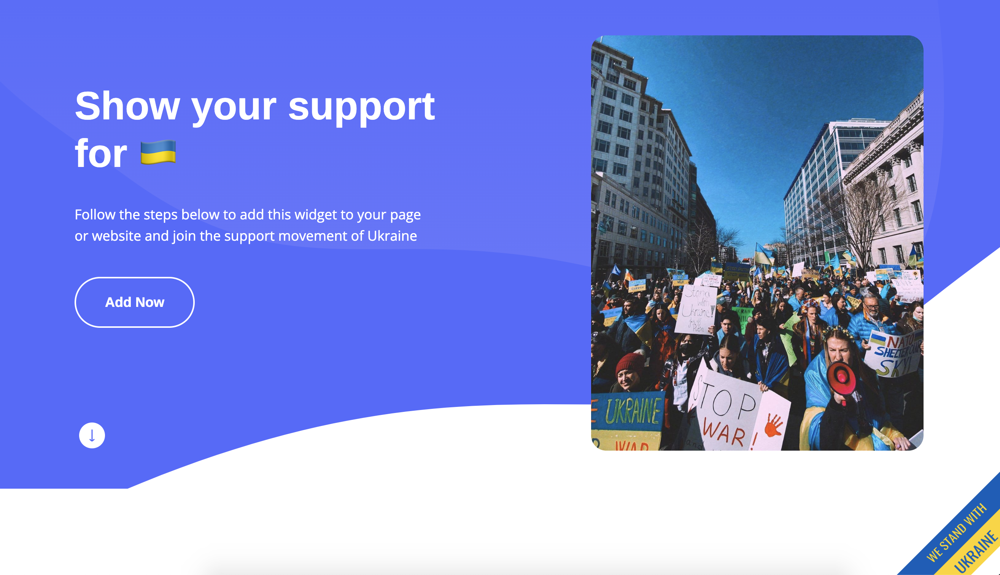

<div id="top"></div>
<!--
*** Thanks for checking out the Best-README-Template. If you have a suggestion
*** that would make this better, please fork the repo and create a pull request
*** or simply open an issue with the tag "enhancement".
*** Don't forget to give the project a star!
*** Thanks again! Now go create something AMAZING! :D
-->


<!-- PROJECT SHIELDS -->
<!--
*** I'm using markdown "reference style" links for readability.
*** Reference links are enclosed in brackets [ ] instead of parentheses ( ).
*** See the bottom of this document for the declaration of the reference variables
*** for contributors-url, forks-url, etc. This is an optional, concise syntax you may use.
*** https://www.markdownguide.org/basic-syntax/#reference-style-links
-->
<!-- [![Contributors][contributors-shield]][contributors-url]
[![Forks][forks-shield]][forks-url]
[![Stargazers][stars-shield]][stars-url]
[![Issues][issues-shield]][issues-url]
[![MIT License][license-shield]][license-url]
[![LinkedIn][linkedin-shield]][linkedin-url] -->


<!-- LOGO -->
<br />
<div align="center">
  <a href="https://www.standwithukraine.dev">
    
  </a>
  

  <h3 align="center">🇺🇦 Stand With Ukraine 🇺🇦</h3>

  <p align="center">
    Add this widget to your website to show support for Ukraine
    <br />
    <a href="#getting-started"><strong>Explore the docs »</strong></a>
    <br />
    <br />
    <a href="https://www.standwithukraine.dev">View Demo</a>
    ·
    <a href="https://github.com/vladyslavnUA/stand-with-ukraine/issues/new">Report Bug</a>
    ·
    <a href="https://github.com/vladyslavnUA/stand-with-ukraine/issues/new">Request Feature</a>
  </p>
</div>


<!-- TABLE OF CONTENTS -->
<details>
  <summary>Table of Contents</summary>
  <ol>
    <li>
      <a href="#about-the-project">About The Project</a>
    </li>
    <li>
      <a href="#getting-started">Getting Started</a>
      <ul>
        <li><a href="#prerequisites">Prerequisites</a></li>
      </ul>
      <ul>
        <li><a href="#installation">Installation</a></li>
      </ul>
    </li>
    <li><a href="#license">License</a></li>
    <li><a href="#contact">Contact</a></li>
  </ol>
</details>


<!-- ABOUT THE PROJECT -->
## About The Project

<!-- [![][product-screenshot]](webs.png) -->
<div align="center">
  <a href="https://www.standwithukraine.dev">
    
  </a>
</div>

<br/>

On February 24th, 2022, the rusian federation launched a full-scale invasion of <b>Ukraine 🇺🇦  (my home).</b> 
For the third month <i>(at time of writing)</i>, the atrocities committed by the rusian federation are accumulating and being discovered with every village, town and city liberated by the Ukrainian Armed Forces.
This support for Ukraine widget was built to be implemented in 2 steps, which can be found <a href="#">below</a>.

<p align="right">(<a href="#top">back to top</a>)</p>

<!-- GETTING STARTED -->
## Getting Started

Follow the steps below to add this widget to your website, or page of your choosing.
Keep in mind, the tag needs to be added to each page you would like the widget to appear on.

### Prerequisites

To use this widget, the only prerequisites needed is `.html` file(s), or other file extensions with syntax similar to html. 

### Installation

_Below is an example of how you can install this widget on your website. The widget doesn't rely on any external dependencies or services._

1. Grab the most updated CDN link at [https://www.standwithukraine.dev/#widget](https://www.standwithukraine.dev/)
2. Find the page(s) you would like this widget on
3. Paste this (replace CDN version if different than posted)
   ```html
   <!-- Support for Ukraine widget -->
    <div id="ukraine"></div>

    <script src="https://cdn.jsdelivr.net/gh/vladyslavnUA/stand-with-ukraine@main/app/templates/app/script.v1.1.js"></script>
   <!-- end widget tag -->

   ```
4. Push your code to production and test the widget 🇺🇦 

<p align="right">(<a href="#top">back to top</a>)</p>


<!-- LICENSE -->
## License

Distributed under the GNU GPLv3 License. See `LICENSE.txt` or https://choosealicense.com/licenses/gpl-3.0/ for more information. 
Available for open-source, making available complete source code of licensed works and modifications, under the same license. <br/><b>Copyright and license notices must be preserved</b>

<!-- <p align="right">(<a href="#top">back to top</a>)</p> -->


<!-- CONTACT -->
## Contact

Vladyslav - vladyslavn@yahoo.com

<p align="right">(<a href="#top">back to top</a>)</p>


<!-- ACKNOWLEDGMENTS
## Acknowledgments

Use this space to list resources you find helpful and would like to give credit to. I've included a few of my favorites to kick things off!

* [Choose an Open Source License](https://choosealicense.com)
* [GitHub Emoji Cheat Sheet](https://www.webpagefx.com/tools/emoji-cheat-sheet)
* [Malven's Flexbox Cheatsheet](https://flexbox.malven.co/)
* [Malven's Grid Cheatsheet](https://grid.malven.co/)
* [Img Shields](https://shields.io)
* [GitHub Pages](https://pages.github.com)
* [Font Awesome](https://fontawesome.com)
* [React Icons](https://react-icons.github.io/react-icons/search)

<p align="right">(<a href="#top">back to top</a>)</p>

 -->


<!-- MARKDOWN LINKS & IMAGES 
<!-- https://www.markdownguide.org/basic-syntax/#reference-style-links 
[contributors-shield]: https://img.shields.io/github/contributors/othneildrew/Best-README-Template.svg?style=for-the-badge
[contributors-url]: https://github.com/othneildrew/Best-README-Template/graphs/contributors
[forks-shield]: https://img.shields.io/github/forks/othneildrew/Best-README-Template.svg?style=for-the-badge
[forks-url]: https://github.com/othneildrew/Best-README-Template/network/members
[stars-shield]: https://img.shields.io/github/stars/othneildrew/Best-README-Template.svg?style=for-the-badge
[stars-url]: https://github.com/othneildrew/Best-README-Template/stargazers
[issues-shield]: https://img.shields.io/github/issues/othneildrew/Best-README-Template.svg?style=for-the-badge
[issues-url]: https://github.com/othneildrew/Best-README-Template/issues
[license-shield]: https://img.shields.io/github/license/othneildrew/Best-README-Template.svg?style=for-the-badge
[license-url]: https://github.com/othneildrew/Best-README-Template/blob/master/LICENSE.txt
[linkedin-shield]: https://img.shields.io/badge/-LinkedIn-black.svg?style=for-the-badge&logo=linkedin&colorB=555
[linkedin-url]: https://linkedin.com/in/othneildrew
[product-screenshot]: images/screenshot.png

-->

<!-- thank you to https://github.com/othneildrew/Best-README-Template/blob/master/README.md for the readme template -->
